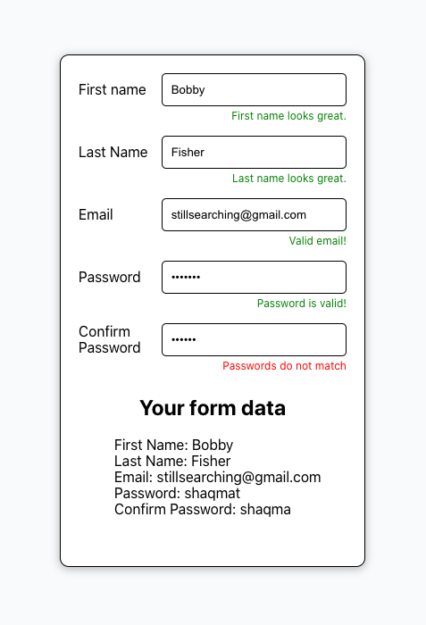

# Core Assignment "More Forms"

This is Christian Johnson's work for Coding Dojo's Part-Time Accelerated MERN Stack.
It was submitted on April 12, 2023.

## Assignment description

This React component renders a form with input fields for first and last name, email, a password and its corresponding confirmation. It uses state variables to store the input values and feedback messages for each field. Event handlers are responsible for updating the respective state variables and validating input. The helper function is used to conditionally display input values as list items summarizing the user's input values.

## Additional Embeleshments

In addition to conditional warnings styled with a red font, successful validation is styled with a green font.

